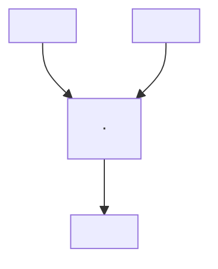

# Opetopes — Intuition & Construction

## What is an Opetope?

An opetope is a multi-dimensional cell, analogous to faces in a simplicial complex (triangles, tetrahedra, ...) but without those intuitive geometric shapes. The higher-dimensional analogs of trees are the shapes — specifically, opetopes are the "well-behaved" ones among all possible higher-dimensional trees.

An opetope is built from a sequence of **atomic diagrams** connected by **bonds**:


Each atomic diagram is one `AtomicDiagramView` in the UI (Finster calls them AtomicDiagrams). Only one is in view at a time; little arrows navigate between them.

The **bond** between adjacent diagrams is the key relationship: *the boxes of one diagram are in bijection with the edges of the next.* In code: `focus.root` (box tree) of one diagram becomes `focus.edgeRoot` (edge tree) of the next.

---

## Two Views of the Same Tree

Every rooted tree has two equivalent depictions:

- **Box tree** ("from above"): nested rectangles, containment = tree structure. Boxes ↔ edges.
- **Edge tree** ("from the side"): nodes and edges as a graph.

These are two projections of the same object in a higher-dimensional space — their intersection is the full structure. The grey leaf-boxes in an atomic diagram play a dual role: they are simultaneously leaves of the box tree *and* nodes of the edge tree.

---

## Atomic Diagrams — Well-Formedness Rules

An atomic diagram combines a box tree and an edge tree. Two rules for well-formedness:

1. The interior of every box is a **non-empty connected subtree** of the edge tree.
2. Both trees are **rooted** (there is a largest enclosing box; there is a root edge).

Rule 1 forbids disconnected box interiors and floating boxes.

---

## The Three-Pane Editor

The UI shows one atomic diagram at a time in three panes:

| Pane | Content | Editable? |
|---|---|---|
| **Prev** | `edgeRoot` as `BoxDiagram` — the inherited substrate | right-click leaf → source extrude |
| **Focus** | Full `AtomicDiagramView` — box tree + edge tree together | double-click edge → drop insert |
| **Succ** | `root` as `TreeDiagram` — the box tree viewed as next edge tree | read-only |

Disks (boxes) live only in Focus/Prev. Succ shows only a `TreeDiagram` — no disks.

---

## Focus → Succ: The Side-View Transformation

The disk nesting in Focus, viewed **from above**, looks like **Towers of Hanoi**:

```
 ___________
(   _____   )
(  (  ·  )  )
(  (_____)  )
(___________)
```

Look at the same nesting **from the side** — two horizontal sticks, one above the other:

```
 ———————

 ———————
```

Rotate each 90° around its own center, shortening until they touch. Their meeting point **is** the new node:

```
|
·
|
```

More disks / deeper nesting in Focus → more branches and height in the Succ tree. This is the geometric heart of the construction.

---

## Termination: The Corolla Condition

An opetope is **complete** when the Succ of the rightmost AtomicDiagram is a **corolla** — a single node with `0..k` input branches and one output stem. Finster's conditions:

1. The **initial** box tree is *linear* (a single chain)
2. The **final** box tree is *trivial* — consists of only the root (i.e. a corolla)

**k=1** (simplest, appears in globular complexes):
```
|
·
|
```

**k=2:**


**k=0 — nullary corolla** (arises from *drops*; not in globular complexes):
```
·
|
```

### Why the corolla is a natural dead end

A corolla has no disks. Looking from the side: nothing to see. No sticks → nothing to rotate → no node forms → **empty diagram**. The construction terminates itself geometrically — not by rule, but by exhaustion of material.

---

## Operations on Cells

### Source Extrusion
Adds a new cell *above* a chosen source face, growing the edge tree upward. In the code: `sourceExtrude(tree, leafId, newCell)` — a leaf becomes a corolla with one new nascent child. Animates via `nascent` field (0 → 1).

### Target Extrusion
Encloses the target in a new box, modifying the edge tree of the next dimension to accommodate the bond. Two steps: enclose target, then enclose remaining tree and add new top cell.

### Drop Insert
Inserts a **nullary corolla** (lollipop, `children: []`) — a new source with no inputs. In code: `dropInsert(diagram, edgeCellId, newCell)` adds the lollipop as a child of `root` and records `{ edgeId, rootId }` in `drops`. Shown as a slashed box in Prev/Focus. Drops are *degeneracies* — automorphisms without bijectivity.

---

## The Globular Complex — Simplest Opetope

Every Focus pane inherits:
```
|
·
|
```
Base disk + one user disk → side view → two sticks → rotate → `| · |` in Succ. Advance, repeat one dimension higher. No branching, no drops — a pure self-similar tower. The 2-glob (two-cell between two arrows) is the simplest non-trivial example; all higher globs are also opetopes. The 2-simplex (triangle) is the *only* overlap between the simplicial and opetopic worlds in dimension ≥ 2.

---

## The Head

The **head** of an opetope is the top-dimensional cell together with its codimension-1 part. The lower-dimensional part is notated with an ellipsis. Each cell appears *exactly twice* in the full diagram: once in its proper dimension, and once in the following dimension as the edge it corresponds to under the bond.

---

## Key Terms

| Term | Meaning |
|---|---|
| **AtomicDiagram** | One slice of an opetopic complex; combines box tree + edge tree (`root` + `edgeRoot`) |
| **Bond** | The bijection between boxes of one diagram and edges of the next; `root` → `edgeRoot` |
| **Box tree** | "From above" view — nested rectangles, containment = tree structure |
| **Edge tree** | "From the side" view — nodes and directed edges |
| **Focus pane** | Where disks are placed; the active AtomicDiagram being constructed |
| **Succ pane** | Shows `root` as `TreeDiagram`; becomes `edgeRoot` of the next diagram |
| **Corolla** | Single node with k≥0 input branches + one output stem; termination shape |
| **Drop** | Degeneracy operation; inserts nullary corolla (lollipop); not in globular complexes |
| **Source extrusion** | Adds a cell above a source face; grows the tree upward |
| **Target extrusion** | Encloses the target; embeds a cell in the next higher dimension |
| **Head** | Top-dimensional cell + its codimension-1 part |
| **Globular complex** | Primitive opetope; `| · |` at every level; no drops; self-similar |
