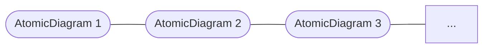

# Opetopes — Intuition & Construction

## What is an Opetope?

An opetope is a multi-dimensional cell, analogous to faces in a simplicial complex (triangles, tetrahedra, ...) but without those intuitive geometric shapes. The higher-dimensional analogs of trees are the shapes — specifically, opetopes are the "well-behaved" ones among all possible higher-dimensional trees.

An opetope is a sequence of **atomic diagrams** connected by **bonds**:



Each atomic diagram is one `AtomicDiagramView` in the UI (Finster calls them AtomicDiagrams). Only one is in view at a time; little arrows navigate between them.

The **bond**: *the boxes of one diagram are in bijection with the edges of the next.*

---

## Two Views of the Same Tree

Every rooted tree has two equivalent depictions:

- **Box tree** ("from above"): nested rectangles, containment = tree structure.
- **Edge tree** ("from the side"): nodes and edges as a graph.

These are projections of the same object in a higher-dimensional space. The grey leaf-boxes play a dual role: simultaneously leaves of the box tree *and* nodes of the edge tree.

---

## Atomic Diagrams — Well-Formedness Rules

1. The interior of every box is a **non-empty connected subtree** of the edge tree.
2. Both trees are **rooted** (there is a largest enclosing box; there is a root edge).

**Consequence of rule 2:** dimension 0 cannot appear in Focus — it has no box tree structure that can be rooted over a substrate. Dimension 0 lives in **Prev** (empty substrate), and Focus begins at dimension 1.

---

## The Three-Pane Editor

| Pane | Content | Editable? |
|---|---|---|
| **Prev** | substrate edge tree as `BoxDiagram` | right-click leaf → source extrude |
| **Focus** | `AtomicDiagramView` — disks over substrate | double-click edge → drop insert |
| **Succ** | `TreeDiagram` only — no disks | read-only |

Disks exist only in Focus/Prev. Succ is a pure tree.

---

## Focus → Succ: The Side-View Transformation

Disk nesting in Focus viewed **from above** — like **Towers of Hanoi**:

```
 ___________
(   _____   )
(  (  ·  )  )
(  (_____)  )
(___________)
```

Look at the same nesting **from the side** — two horizontal sticks, one above the other:

```
 ———————

 ———————
```

Rotate each 90° around its own center until they touch. Their meeting point **is** the new node:

```
|
·
|
```

More/deeper nesting → more branches and height in Succ.

---

## The Data Structure

```typescript
// Global ID supply — unique across the entire opetope, SVG elements,
// and force-layout constraint anchors. TypeScript is not dependently typed,
// so cross-tree ID contracts are runtime-only; global uniqueness is the foundation.
let _nextId = 0
function freshId(): string { return String(_nextId++) }

type Drop = {
  dropId: string     // globally unique primary key — bonds to lollipop in Succ
}

type Tree = {
  away:     Set<string>        // SET of substrate branch IDs this disk avoids
  drops:    Drop[]             // drops on THIS node's outgoing branch (stem for root;
  //                           //   branch to parent for all others)
  children: [string, Tree][] | null
  //         ^ branch ID
  //  null = open leaf;  [] = nullary corolla
}

// under() is always computed, never stored
function under(substrate: Tree | null): Set<string> {
  if (substrate === null) return new Set()  // dim 0: empty substrate
  return allBranchIds(substrate)
}

// support = under(substrate) \ disk.away
function support(disk: Tree, substrate: Tree | null): Set<string> {
  const u = under(substrate)
  return new Set([...u].filter(id => !disk.away.has(id)))
}

type Opetope = Tree[]   // length n for an n-dimensional opetope
```

- `away` and `under()` are **sets** (`Set<string>`), not arrays.
- There is **no `cell` field** — disk identity is the `string` given by the parent. Labels and dims are orthogonal (separate map).
- Branch IDs must be **globally unique** within the opetope — enforced via `freshId()`. This also provides stable IDs for SVG elements and force-layout constraints.
- The substrate of `Tree[i]` is `Tree[i-1]`; `away` values reference branch IDs from there.
- An **opetope** is `Tree[]` of length `n` for an n-dimensional opetope.

### Soundness rules (checked at runtime)

For each disk, let `support = under \ away`:

0. **Connectivity** — `support` must be a connected subtree of the substrate tree. Since every tree has a unique path between any two nodes, the rule is: for every pair of nodes `u, v ∈ support`, every node on the unique path `u → v` must also be in `support`. Any node on the path that is in `away` makes the disk invalid.

For siblings in any `children` array, let `under` = parent's straddled set:

1. `away_i` must be **mutually unequal** (no two sibling disks are the same disk)
2. Straddled sets `(under \ away_i)` must be **pairwise disjoint**
3. `away ≠ []` unless `under = []` (no disk may cover its entire parent unless the substrate is empty)
4. At least one inner disk required (no bare-stick Succ with no nodes)

Rule 3 permits the globular case: when `under = {}` at every level, `away = []` is forced, giving the self-similar chain.

Rule 1 in action: in dimension 0, `under = {}`. Two sibling inner disks would both have `away = []` — equal — violation. Hence no branching at dimension 0 without substrate nodes to differentiate siblings.

### Drops

A **drop** is parasitic on an edge of the edge tree. Every node has exactly one outgoing branch (its stem for the root, or the branch leading up to its parent for all others). Drops on that branch are stored directly on the node as `drops: Drop[]`. The `dropId` bonds to a lollipop (`children: []`) in Succ. Drops do not appear in globular complexes.

---

## Termination: The Corolla Condition

An opetope is **complete** when the Succ of the rightmost AtomicDiagram is a **corolla** — a single node with `0..k` input branches and one output stem.

Finster's boundary conditions:
1. **Initial** box tree is *linear* (single chain, no branching)
2. **Final** box tree is *trivial* — a corolla (one node, k leaves, no nesting)

**k=1** (globular):
```
|
·
|
```

**k=0 — nullary corolla** (from drops; not in globular complexes):
```
·
|
```

### Why the corolla is a natural dead end

A corolla has no disks. Side view: nothing to see. No sticks → nothing to rotate → no node forms → empty diagram. The construction terminates geometrically, not by rule.

---

## The Globular Complex — Simplest Opetope

Every level: substrate = `| · |`, `under = {}`, `away = []` forced. Base disk + one inner disk → `| · |` in Succ. Advance, repeat. No branching, no drops — a pure self-similar tower. All higher globs are opetopes. The 2-simplex is the *only* overlap with the simplicial world (dimension ≥ 2).

---

## Operations on Cells

### Source Extrusion
Right-click a leaf box in Prev → grows the substrate upward. A leaf becomes a corolla with one new nascent child. Animates via `nascent` field (0 → 1).

### Target Extrusion
Encloses the target in a new box, modifying the edge tree of the next dimension. Two steps: enclose target, then enclose remaining tree and add new top cell.

### Drop Insert
Double-click an edge in Focus → adds a lollipop (`children: []`) to that branch's `Drop[]`. Shown as a slashed box in Prev/Focus. Drops are degeneracies — automorphisms without bijectivity.

---

## The Head

The **head** of an opetope is the top-dimensional cell plus its codimension-1 part (lower-dimensional part notated with an ellipsis). Each cell appears *exactly twice*: once in its proper dimension, and once in the following dimension as the edge under the bond.

---

## Key Terms

| Term | Meaning |
|---|---|
| **AtomicDiagram** | One slice of an opetopic complex; box tree + edge tree |
| **Bond** | Bijection: boxes of one diagram ↔ edges of the next |
| **Box tree** | "From above" — nested disks; `root` in code |
| **Edge tree** | "From the side" — nodes and edges; `edgeRoot` / substrate in code |
| **Focus pane** | Active AtomicDiagram; where disks are placed over the substrate |
| **Prev pane** | Substrate (edge tree of current level = box tree of previous level) |
| **Succ pane** | Box tree of current level = edge tree of next level; no disks |
| **`away`** | Substrate node IDs a disk avoids; complement of its straddled set |
| **`under`** | Straddled set of the parent disk; always computed, never stored |
| **Corolla** | Single node with k≥0 input branches + one output stem; termination shape |
| **Drop** | Degeneracy; parasitic on a substrate child edge; lollipop in Succ |
| **Source extrusion** | Grows substrate upward at a leaf |
| **Target extrusion** | Embeds a cell in the next higher dimension |
| **Head** | Top-dimensional cell + its codimension-1 part |
| **Globular complex** | Primitive opetope; `away=[]`, `under={}` at every level; no drops |
