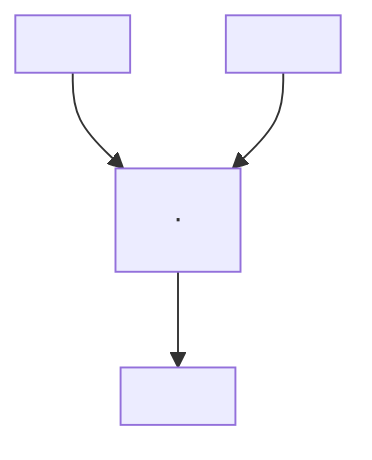

# Opetopes — Intuition & Construction

## What is an Opetope?

An opetope is a multi-dimensional cell, analogous to faces in a simplicial complex (triangles, tetrahedra, ...) but without those intuitive geometric shapes. Instead, opetopes are built up through a sequence of **bonds** connected by **Focus panes** (AtomicDiagrams, per Finster).


Each Focus pane is one `AtomicDiagramView` in the UI. Only one is shown at a time; little arrows navigate between them.

---

## The Focus Pane

The Focus pane **inherits a tree** from the adjacent bond. This tree is the scaffold — like a wall climber's surface — on which the user places **disks** (encircling nodes or subtrees). Disks are the marks of construction.

- The **base disk** around the middle node is axiomatic — it cannot be removed.
- The user may add further disks, creating nested rings.

Viewed from above, nested disks look like **Towers of Hanoi**:

```
 ___________
(   _____   )
(  (  ·  )  )
(  (_____)  )
(___________)
```

---

## Focus → Succ: The Side-View Transformation

Look at the nested disks **from the side** — two horizontal sticks, one above the other:

```
 ———————

 ———————
```

Rotate each 90° around its own center, shortening until they touch. Their meeting point **is** the new node:

```
|
·
|
```

The Succ pane shows only a `TreeDiagram` — **no disks**. Disks are exclusive to Focus.

---

## Building Up Dimensions

More disks / deeper nesting in Focus → more branches and height in the Succ tree. Advancing Succ → Focus gives a new playground. Repeat, dimension by dimension.

---

## Termination: The Corolla Condition

The opetope is **complete** when the Succ of the rightmost AtomicDiagram is a **corolla** — a single node with `0..k` input branches and one output stem.

**k=1** (simplest in globular complexes):
```
|
·
|
```

**k=2:**


**k=0 — nullary corolla** (arises from *drops*, not in globular complexes):
```
·
|
```

---

## Why the Corolla is a Natural Dead End

A corolla has **no disks**. Looking from the side: nothing. No sticks → nothing to rotate → no node forms → **empty diagram**. The construction terminates itself geometrically.

---

## The Globular Complex — Simplest Opetope

Every Focus pane inherits `| · |`. The base disk plus one user disk → side view → two sticks → rotate → `| · |` in Succ. Advance, repeat one dimension higher. No branching, no drops — a pure self-similar tower.

---

## Key Terms

| Term | Meaning |
|---|---|
| **Bond** | A face/cell at one dimension |
| **Focus pane** | The overlap between two adjacent bonds; where disks are placed |
| **AtomicDiagram** | Finster's name for one Focus pane (`AtomicDiagramView` in code) |
| **Succ pane** | Shows the `TreeDiagram` generated from Focus disks; no disks of its own |
| **Disk** | A user-placed encirclement of a node or subtree in Focus |
| **Corolla** | A single node with k≥0 input branches and one output stem; termination shape |
| **Drop** | An "automorphism" without bijectivity; gives rise to nullary corollas |
| **Globular complex** | Primitive opetope with `| · |` at every level, no drops |
