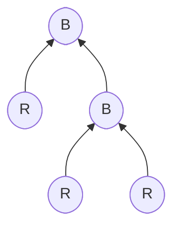
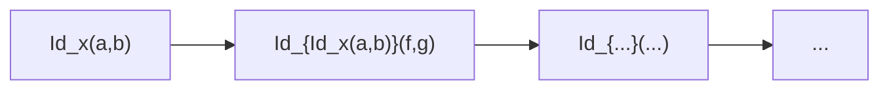

# Types in an Opetopic Setting (Speculative)

Working notes toward a type theory grounded in opetopic categories.
Heavily inspired by Eric Finster's *Higher Dimensional Syntax* program.
Treat as a brain dump — not yet a finished theory.

---

## Core Idea

Terms are freely constructed from a set of **morphism constructors**, whose shapes
are defined by opetopes. Each constructor lives at a specific dimension and has a
source tree that encodes its arity.

---

## The Nominal Dimension (-1)

Finster's key insight: prepend a **nominal dimension** before the opetope proper.
This occupies the empty space to the left of dimension 0 in the opetopic complex.
It acts as a **type label** — a card that names the data type.

Every opetope carrying the same nominal card belongs to that data type:
- The **nominal card alone** (dim -1): the type itself — `BT`
- **Dim 0 cells** with that card: terms of the type — `x : BT`
- **Dim 1 cells** with that card: constructors — unary, binary, ...
- **Higher cells**: rewrite rules, coherences, ...

---

## Example: Binary Trees

```
data BT where
  R : BT
  B : BT -> BT -> BT
```

The four opetopic diagrams corresponding to this definition
(from Finster's Higher Dimensional Syntax slides):

| Diagram | Opetopic shape | Meaning |
|---|---|---|
| `[BT]` alone | nominal card | the type BT itself |
| `[BT] [x]` | card + enclosed point | a term `x : BT` |
| `[BT] [x] [f] [R]` | card + term + morphism + drop | the `R` leaf constructor |
| `[BT] [[x][f]] [[f][f]] [B]` | card + two terms + binary node | the `B` branch constructor |

The **source tree shape** of the constructor cell directly encodes its arity:
- `R` — nullary (drop/lollipop, no inputs)
- `B` — binary (two input wires, triangle shape in the geometric picture)

---

## Types, Terms, Constructors

- **Types** = nominal cards (dimension -1): classify everything above them
- **Type constructors** = cells whose source tree is over the nominal card
- **Data constructors** = cells that build terms: their shape (unary, binary, ...)
  is the arity of the constructor
- **Terms** = 0-cells tagged with a nominal card
- **Rewrites / proofs** = higher cells

This gives a natural hierarchy matching dependent type theory:

| Dimension | Role |
|---|---|
| -1 | Type (nominal card) |
| 0 | Term |
| 1 | Morphism between terms / constructor |
| 2 | Rewrite / proof |
| n ≥ 3 | Higher coherence |

---

## Term Construction = Opetopic Composition

A concrete term of type BT is displayed as an opetopic **composite** — enclosed in
a red box with a single output wire at the bottom. Example from Finster's slides,
representing `B(R, B(R, R))`:



A branch whose left child is a leaf and whose right child is another branch with
two leaves. Reading the diagram:

- Leaves = `R` nodes (nullary, drops — no input wires)
- Internal nodes = `B` nodes (binary — two input wires each)
- The red enclosing box = **opetopic composition**, collapsing the tree of
  constructor applications into a single output cell

The tree structure of the term *is* the source tree of the composite. There is no
separate "evaluation" step — the term and its opetopic shape are the same thing.

The left diagram `[BT] [x] [f]` is the *general schema* for a term; the red box
is a *specific composite* — a particular inhabitant built by applying constructors.

---

## The Nominal Card as `newtype` (Speculative Analogy)

Only `R` and `B` are **exported** data constructors — the things the programmer sees.
The rest of the complex (`[BT]`, `[x]`, `[f]`) is **administrative scaffolding**:
the 0- and 1-dimensional faces required by the opetopic structure to be well-formed,
invisible at the type theory level.

Finster draws a **box around the prefix** (dimensions -1..n) of the opetopic complex,
keeping it separate from what follows. This box is the geometric expression of
*hiding the scaffolding* — distilling a higher-dimensional structure down to a usable
thing at a lower dimension.

The analogy with Haskell's `newtype` is suggestive but not yet precise:

```haskell
newtype BT = BT { unBT :: forall r. r -> (BT -> BT -> r) -> r }
--            ^^^ the box                ^^^^^^^^^^^^^^^^^^^^^^^^^^^ the scaffolding
```

The `newtype` names the type, hides the Church/Scott encoding, and exposes only
`R` and `B` as smart constructors. The nominal card plays a similar role in the
opetopic complex — a naming device that abstracts over the internal plumbing.

Whether this analogy is exact, or just a useful intuition pump, is an open question.
The key idea to preserve: **higher-dimensional scaffolding gets distilled to a clean,
low-dimensional interface** — and the box (nominal card) is what marks that boundary.

---

## Type Formation = Dimensional Shift

From Finster's slides: a higher-dimensional cell can be **shifted down** to the
nominal position (-1), making it appear as a 0-cell — a new type. The caption
on the slide is literally: *"One has a new type."*

Example: `k` is technically a 2-cell mediating between two chains of 1-cells, but
shifted to the -1 position it becomes a bare point — a new type name. The
higher-dimensional scaffolding (the chains) becomes the internal structure; `k`
is the clean exported face.

**Type formation is dimensional shift** — collapsing a higher cell to a point and
declaring it a type. The prefix box marks the boundary between scaffolding and
the exported interface.

---

## Identity Types and the HoTT Tower

From Finster's slides, the identity type notation:

- `[X] [a over b]` = **Id_x(a, b)** — type of witnesses that 1-cells `a` and `b` are equal
- `[X] [a over b] [f over g]` = **Id_{Id_x(a,b)}(f, g)** — homotopies between paths
- Each level adds one more cell to the prefix box

This is the full **∞-groupoid / HoTT tower**, falling out naturally from the
dimensional shift mechanism:



---

## Parametrised and Dependent Types

The prefix box contents are the **free variables** the type depends on — `x`, `a`,
`b` are parameters to `Id`. Dependent types are opetopic complexes with a longer
prefix where later cells reference earlier ones:

| Kind | Prefix |
|---|---|
| Simple type | just the nominal card |
| Parametrised type | nominal card + extra cells as parameters |
| Dependent type | prefix cells that reference earlier ones |

---

## `Refl` = Drop on the Nominal Card

**`Refl_x : Id_x(a, a)`** — the reflexivity constructor — is a **drop on the point**
of `Id_x(a,b)`. A drop is a degeneracy: it collapses a 1-cell to a point, identifying
`a = a`. The trivial path *is* the drop. So `Refl` is not an extra axiom — it is the
**existing drop mechanism** applied to the identity type's nominal card.

Degeneracies in opetopic theory already know about reflexivity!

This also suggests:
- **`J` eliminator** = universal property of that drop (to be worked out)

---

## To Be Developed

- Dependent types: how does the nominal card generalise to families?
- Connection to the CCC/lambda structure in `lambdas.md`
- Finster's full treatment of type formers (Π, Σ, Id) in this setting
- Links to specific Finster talks/papers
