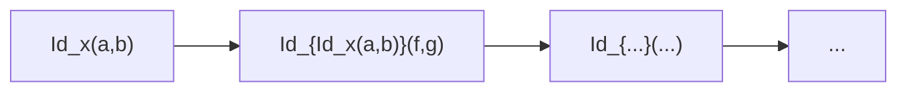

# Types in an Opetopic Setting (Speculative)

Working notes toward a type theory grounded in opetopic categories.
Heavily inspired by Eric Finster's *Higher Dimensional Syntax* program.
Treat as a brain dump — not yet a finished theory.

---

## Core Idea

Terms are freely constructed from a set of **morphism constructors**, whose shapes
are defined by opetopes. Each constructor lives at a specific dimension and has a
source tree that encodes its arity.

---

## The Nominal Dimension (-1)

Finster's key insight: prepend a **nominal dimension** before the opetope proper.
This occupies the empty space to the left of dimension 0 in the opetopic complex.
It acts as a **type label** — a card that names the data type.

Every opetope carrying the same nominal card belongs to that data type:
- The **nominal card alone** (dim -1): the type itself — `BT`
- **Dim 0 cells** with that card: terms of the type — `x : BT`
- **Dim 1 cells** with that card: constructors — unary, binary, ...
- **Higher cells**: rewrite rules, coherences, ...

---

## Example: Binary Trees

```
data BT where
  R : BT
  B : BT -> BT -> BT
```

The opetopic diagrams from Finster's *Higher Dimensional Syntax* slides.
**Only `R` and `B` are exported** — everything else is administrative scaffolding
required by the opetopic structure but invisible to the user of the type.

| Diagram | Opetopic shape | Meaning |
|---|---|---|
| `[BT]` alone | nominal card | the type BT itself |
| `[BT] [x]` | card + administrative 0-cell | scaffolding — NOT a user-facing term |
| `[BT] [x] [f] [R]` | card + scaffolding + drop | the exported `R` leaf constructor |
| `[BT] [[x][f]] [[f][f]] [B]` | card + scaffolding + binary node | the exported `B` branch constructor |

The **source tree shape** of the constructor cell directly encodes its arity:
- `R` — nullary (drop/lollipop, no inputs)
- `B` — binary (two input wires, triangle shape in the geometric picture)

---

## Types, Terms, Constructors

- **Types** = nominal cards (dimension -1): classify everything above them
- **Data constructors** = exported cells (`R`, `B`, ...): their source tree shape
  encodes arity; everything else in the complex is administrative scaffolding
- **User-facing terms** = opetopic **composites** (the red box) — trees of
  constructor applications collapsed into a single output cell
- **Administrative cells** = the 0- and 1-dimensional faces (`x`, `f`, ...) required
  by the opetopic structure to be well-formed; not exported to the user
- **Rewrites / proofs** = higher cells

| Dimension | Role |
|---|---|
| -1 | Type (nominal card) |
| 0 | Administrative scaffolding (e.g. `x`) |
| 1 | Constructor or administrative morphism (e.g. `f`) |
| 2+ | Higher constructors, rewrites, coherences |
| composite | User-facing term — a tree of constructors in a red box |

---

## Term Construction = Opetopic Composition

A concrete term of type BT is displayed as an opetopic **composite** — enclosed in
a red box with a single output wire at the bottom. Example from Finster's slides,
representing `B(R, B(R, R))`:


A branch whose left child is a leaf and whose right child is another branch with
two leaves. Reading the diagram:

- Leaves = `R` nodes (nullary, drops — no input wires)
- Internal nodes = `B` nodes (binary — two input wires each)
- The red enclosing box = **opetopic composition**, collapsing the tree of
  constructor applications into a single output cell

The tree structure of the term *is* the source tree of the composite. There is no
separate "evaluation" step — the term and its opetopic shape are the same thing.

The left diagram `[BT] [x] [f]` is the *general schema* for a term; the red box
is a *specific composite* — a particular inhabitant built by applying constructors.

---

## The Nominal Card as `newtype` (Speculative Analogy)

Only `R` and `B` are **exported** data constructors — the things the programmer sees.
The rest of the complex (`[BT]`, `[x]`, `[f]`) is **administrative scaffolding**:
the 0- and 1-dimensional faces required by the opetopic structure to be well-formed,
invisible at the type theory level.

Finster draws a **box around the prefix** (dimensions -1..n) of the opetopic complex,
keeping it separate from what follows. This box is the geometric expression of
*hiding the scaffolding* — distilling a higher-dimensional structure down to a usable
thing at a lower dimension.

The analogy with Haskell's `newtype` is suggestive but not yet precise:

```haskell
newtype BT = BT { unBT :: forall r. r -> (BT -> BT -> r) -> r }
--            ^^^ the box                ^^^^^^^^^^^^^^^^^^^^^^^^^^^ the scaffolding
```

The `newtype` names the type, hides the Church/Scott encoding, and exposes only
`R` and `B` as smart constructors. The nominal card plays a similar role in the
opetopic complex — a naming device that abstracts over the internal plumbing.

Whether this analogy is exact, or just a useful intuition pump, is an open question.
The key idea to preserve: **higher-dimensional scaffolding gets distilled to a clean,
low-dimensional interface** — and the box (nominal card) is what marks that boundary.

---

## Type Formation = Dimensional Shift

From Finster's slides: a higher-dimensional cell can be **shifted down** to the
nominal position (-1), making it appear as a 0-cell — a new type. The caption
on the slide is literally: *"One has a new type."*

Example: `k` is technically a 2-cell mediating between two chains of 1-cells, but
shifted to the **-1 position** it becomes a new **nominal card** — a new type name.
The higher-dimensional scaffolding (the chains) becomes the prefix/internal structure;
`k` is the clean exported face.

**Type formation is dimensional shift** — taking a higher cell and placing it at the
-1 position, declaring it a new type. The prefix box marks the boundary between
scaffolding and the exported interface.

---

## Identity Types and the HoTT Tower

From Finster's slides, the identity type notation:

- `[X] [a over b]` = **Id_x(a, b)** — type of witnesses that 1-cells `a` and `b` are equal
- `[X] [a over b] [f over g]` = **Id_{Id_x(a,b)}(f, g)** — homotopies between paths
- Each level adds one more cell to the prefix box

This is the full **∞-groupoid / HoTT tower**, falling out naturally from the
dimensional shift mechanism:



---

## Parametrised and Dependent Types

The prefix box contents are the **free variables** the type depends on — `x`, `a`,
`b` are parameters to `Id`. Dependent types are opetopic complexes with a longer
prefix where later cells reference earlier ones:

| Kind | Prefix |
|---|---|
| Simple type | just the nominal card |
| Parametrised type | nominal card + extra cells as parameters |
| Dependent type | prefix cells that reference earlier ones |

---

## `Refl` = Drop on the Nominal Card

**`Refl_x : Id_x(a, a)`** — the reflexivity constructor — is a **drop on the point**
of `Id_x(a,b)`. A drop is a degeneracy: it collapses a 1-cell to a point, identifying
`a = a`. The trivial path *is* the drop. So `Refl` is not an extra axiom — it is the
**existing drop mechanism** applied to the identity type's nominal card.

Degeneracies in opetopic theory already know about reflexivity!

### Conjecture: `J` = target universality of `Refl`

`J` is the eliminator for identity types: to prove `P(b, p)` for any `b : X` and
`p : Id_x(a, b)`, it suffices to prove `P(a, Refl_a)`. Formally:

- Given `P : (b : X) → Id_x(a, b) → Type` and `d : P(a, Refl_a)`
- `J` constructs a term of type `P(b, p)` for any `b` and `p`

This is **transport along a path** — `Refl` is the trivial case, and `J` says every
path is reachable from `Refl` by induction.

In the opetopic picture: since `Refl` = drop on the nominal card of `Id`, and drops
are degeneracies with universal properties, `J` may be exactly the **target
universality of `Refl`** — the lifting property that comes for free with any
universal cell. Reflexivity would then be a universal cell, and `J` its counit.

This would be a remarkable unification: the whole transport/substitution machinery
of HoTT falling out of the universal property of a single drop.

**To be researched**: verify that the dimensions, directions and type families
align correctly with the opetopic universal property definition.

---

## Dependent Types in Practice: `Vec A n` (⚠️ highly speculative)

From Finster's slides — `Vec (A : Set) : Nat -> Set`, length-indexed vectors:

```
Nil  : Vec A 0
Cons : A -> Vec A n -> Vec A (n + 1)
```

The four opetopic diagrams:

| Diagram | Reading |
|---|---|
| `[Vec] [x]` | administrative scaffolding — nominal card + 0-cell |
| `[Vec] [x over x] [Nat]` | `Vec` is indexed by `Nat` — green cell as parameter |
| `[Vec] [x] [0] [Nil]` | exported `Nil` constructor: index instantiated to `0` |
| `[Vec] [x over x] [n over n+1] [A]` | exported `Cons`: index steps `n → n+1`, element type `A` |

### The green cell — imported nominal card (highly speculative)

The green border on `Nat` may indicate a cell **imported from another nominal card**
— a cross-reference between opetopic complexes. This would be how dependent types
*depend on values of other types*: the `Nat` index slot is a green-bordered cell
pulled in from the `Nat` complex.

The specific instantiations (`0` for `Nil`, `n+1` for `Cons`) would then be
*filled context holes* — particular terms of `Nat` substituted into the index slot.

This is a hunch only. Finster does not explain the green cell in the slides and the
correct interpretation may be quite different.

---

## To Be Developed

- Dependent types: how does the nominal card generalise to families?
- Connection to the CCC/lambda structure in `lambdas.md`
- Finster's full treatment of type formers (Π, Σ, Id) in this setting
- Links to specific Finster talks/papers

---

## Finster's Open Questions (with partial answers)

From the closing slide of *Higher Dimensional Syntax*:

### 1. Find a theory of higher functions. (Higher λ-calculus??)

**Partial answer** — see `lambdas.md`. The layered construction (monoidal closed =
opetopic base + dissecting binary morphisms; CCC = + cartesian flag) already operates
at all dimensions simultaneously. Because the opetopic base is inherently
higher-dimensional, currying and apply work for n-cells just as for 1-cells. A 2-cell
between morphisms can be curried just as a 1-cell can.

Conjecture: the higher λ-calculus is simply **the dissection axiom applied at every
dimension** — no new structure needed beyond what `lambdas.md` already describes.

### 2. What are cofree/coinductive definitions?

**Very partial.** The opetopic setting handles coinduction naturally — target and
source universality are already mutually coinductive (see `Equivalences.svelte` and
the stability conjecture). Cofree constructions would likely be the **terminal
coalgebra** of some endofunctor on opetopic sets. The connection is suggestive but
unexplored.

### 3. Semantic Theorems

**Open.** Likely refers to soundness, completeness, and normalisation for the
higher-dimensional type theory. No partial answer yet — this is the hardest and
most important of the three.

---

## Universe Hierarchy as Drops (Conjecture)

Consider a stratified type with nested data declarations:

```haskell
data Foo : Set_2 where
  data Bar : Foo where
    Baz : Bar
    Quux : Nat -> Bar
  Zup : Foo
```

Three levels:

- **`Foo : Set_2`** — a kind (level 2)
- **`Bar : Foo`**, **`Zup : Foo`** — types (level 1, classified by `Foo`)
- **`Baz : Bar`**, **`Quux : Nat → Bar`** — values (level 0, classified by `Bar`)

In the opetopic picture, the universe hierarchy `Set_0, Set_1, Set_2, ...` is itself
encoded as a chain of **drops**:

```
... ↓Set_2  ↓Set_1  ↓Set_0
```

`Set_n` is a drop in `Set_(n+1)`'s scaffolding (with intermediate administrative
cells). This is natural: a drop is a degeneracy — a "constant" or "trivial" cell —
and `Set_n` *is* exactly a specific constant element sitting inside the larger
universe `Set_(n+1)`, not doing anything active at that level.

The cascaded `data inside data` structure maps onto an **iterated prefix**:

| Dimension | Role |
|---|---|
| ... | higher universes |
| -2 | `Set_2` / kind level |
| -1 | `Set_1` / type level — nominal cards (`Bar`, `Zup`) |
| 0+ | `Set_0` / value level — constructors (`Baz`, `Quux`) |

**Universe cumulativity** (`Set_n : Set_(n+1)`) falls out from the drop chain:
the drop *is* an element of the higher universe. **Universe polymorphism** would be
an operation parameterised over the drop chain — working at any level uniformly.

Both Agda and Ωmega implement related hierarchies:
- **Agda**: `Set_i : Set_{i+1}`, optional cumulativity via `--cumulativity` flag
  (subtyping `Set_i <: Set_{i+1}`). See [universe levels](https://agda.readthedocs.io/en/latest/language/universe-levels.html).
- **Ωmega** (Tim Sheard): unbounded predicative hierarchy `*0, *1, *2, ...` for
  values, types, kinds, sorts. See Sheard & Diehl,
  [Leveling up dependent types](https://dl.acm.org/doi/10.1145/2502409.2502414) (DTP@ICFP 2013).

Neither encodes the hierarchy as drops explicitly — that is the opetopic conjecture.

---

## Conclusion: The Proof is in the Pudding

All of the above is conceptual scaffolding until there is a working implementation
where one can:

- Declare a nominal card and watch the prefix box form
- Place `R` and `B` as constructor cells and see the exported interface emerge
- Build a composite term like `B(R, B(R, R))` in the editor and see the red box
  collapse it
- Verify that the drop on `Id`'s nominal card really does behave like `Refl`
- Test whether the `J` conjecture holds operationally

The speculative skills (`types.md`, `lambdas.md`) serve as a **research roadmap** —
knowing what we are aiming for shapes the implementation decisions. But the feedback
loop will be brutal: things that look elegant categorically may be awkward to
implement, and the implementation will likely reveal misunderstandings that no amount
of armchair theorising can catch.
